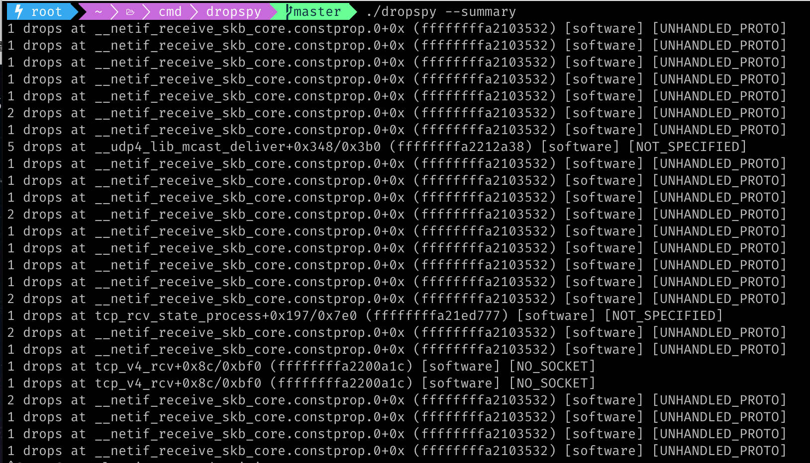

# dropspy
dropspy is reworking of the C-language [dropwatch](https://github.com/nhorman/dropwatch) tool in Go, with some extra features.

The original version `dropspy` is at [superfly/dropspy](https://github.com/superfly/dropspy),


## Installation

```bash
go install github.com/smallnest/dropspy/cmd/dropspy@latest
```

## Usage



```bash
./dropspy: Report packet drops from Linux kernel DM_MON.
./dropspy [flags] [pcap filter]
ie: ./dropspy --hex -I eth0 udp port 53
  -c, --count uint          maximum drops to record
      --hex                 print hex dumps of matching packets
      --hw                  record hardware drops (default true)
  -I, --iface stringArray   show only drops on this interface (may be repeated)
      --isym stringArray    include drops from syms matching regexp (may be repeated)
      --maxlen uint         maximum packet length for drops
      --minlen uint         minimum packet length for drops
      --summary             print summary of drops
      --sw                  record software drops (default true)
  -w, --timeout string      duration to capture for (300ms, 2h15m, &c)
      --xsym stringArray    exclude drops from syms matching regexp (may be repeated)
```

You can only print the summary of drops per seconds:

```bash
./dropspy --summary
```

## License
[MIT](https://choosealicense.com/licenses/mit/)
